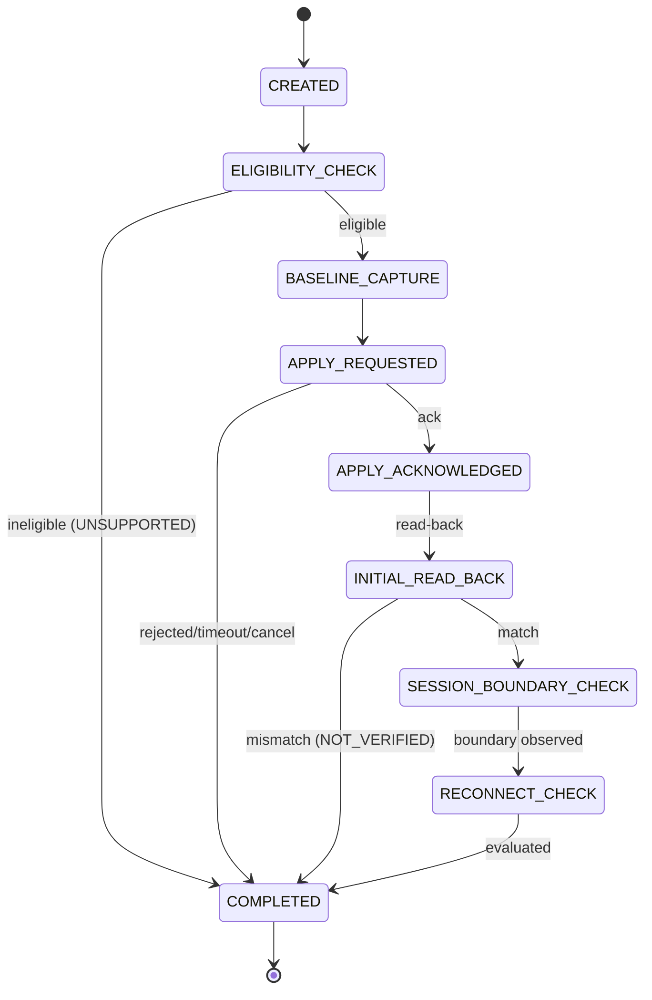

# Phase 18 — Design: Persistence Verification Framework

## Architecture

```
FeatureProtocolPort (Phase 9) ← caller drives
         ↓ outcomes as events
VerificationEvent → VerificationStateMachine → VerificationRecord
         ↓
EvidenceEvaluator → strongest proven PersistenceScope
         ↓
VerificationRepository → VerificationStorage (Phase 17 mechanisms)
```

## Package: `com.omnibuds.core.verification` (layer 5)

| Type | Role |
|---|---|
| `VerificationId` | Unique per attempt |
| `VerificationStage` / `VerificationOutcome` | Progress vs terminal result |
| `PersistenceScope` | Ordered scopes (SESSION_ONLY … FIRMWARE_PERSISTENT, UNKNOWN) |
| `ApplicationStatus` | NOT_ATTEMPTED … READ_BACK_CONFIRMED … |
| `VerificationEvidence` / `EvidenceType` | Structured, provenance-bearing |
| `VerificationPlan` | Declarative, capability-derived |
| `VerificationEvent` / `LifecycleBoundary` | Event-driven boundary |
| `VerificationRecord` | Immutable attempt state |
| `VerificationStateMachine` | Pure deterministic transitions |
| `ReadBackComparison` | Exact-match comparison (extension point) |
| `EvidenceEvaluator` | Strongest-scope evaluation, no scores |
| `VerificationFailure` | Maps to OmniBudsErrorCategory |
| `VerificationStorage` | Local seam (bridges Phase 17 storage) |
| `VerificationRepository` | Versioned persistence + recovery |
| `VerificationRecordCodec` | Versioned JSON envelope |

## Key decisions

1. **Event-driven, not port-driving.** The framework never calls
   `FeatureProtocolPort` — the caller does and feeds outcomes as events.
   This avoids sideways `feature` (5) imports and keeps the framework
   pure and testable.

2. **Stages ≠ outcomes.** 12 stages track progress; 7 outcomes are terminal.
   Plans skip inapplicable stages.

3. **Timeout is ambiguous.** Never success, never failure → INCONCLUSIVE.

4. **Local preference ≠ hardware evidence.** `LOCAL_PREFERENCE_STORED`
   evidence type exists only to mark this; the evaluator ignores it for scope.

5. **ConfigurationValueJson moved to `core.config`.** It's a generic codec
   for `ConfigurationValue` (layer 2); both `configuration` and
   `verification` (layer 5) now import it downward.


