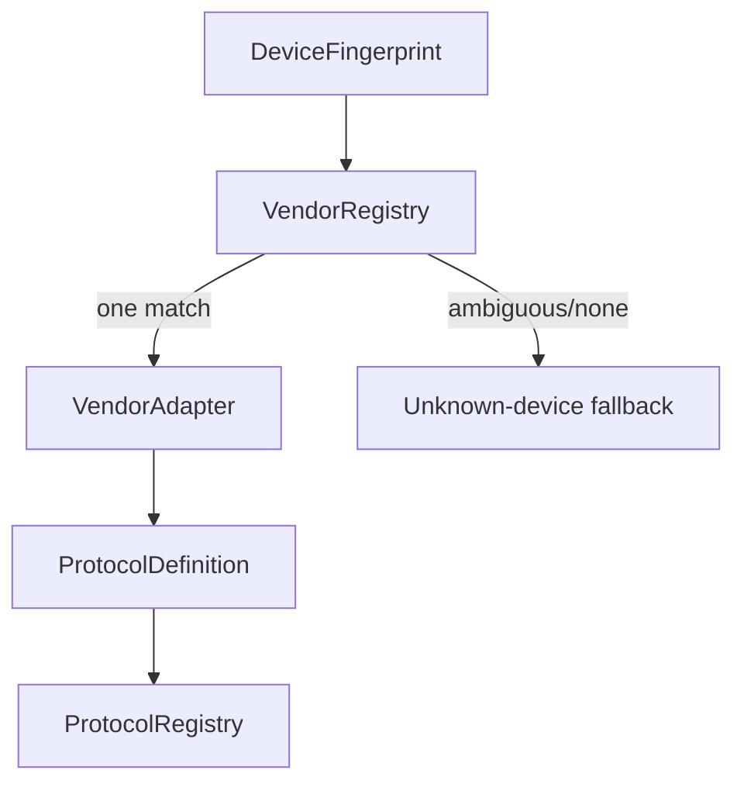

# Phase 19 — Design: Vendor Adapter Infrastructure

## What was built

Phase 19 did not implement a vendor protocol (insufficient evidence).
It built the infrastructure that future evidence-backed adapters will plug into.

## Package: `com.omnibuds.core.vendor` (layer 5)

| Type | Role |
|---|---|
| `VendorAdapter` | Contract: adapterId, displayName, match(), protocol, supportedFirmware |
| `MatchResult` | Matched / NotMatched / Ambiguous |
| `VendorRegistry` | Register, resolve, ambiguity detection |
| `NullVendorAdapter` | Matches nothing; honest default |

## Resolution rules

1. Exactly one `Matched` + zero `Ambiguous` → that adapter.
2. Any `Ambiguous` → null (writes stay disabled).
3. Zero matches → null (unknown-device fallback).
4. Multiple `Matched` → null (conflicting; safest is none).

## Integration points (for future adapters)

- **Phase 5:** `DeviceFingerprint` is the matching input.
- **Phase 7:** `ProtocolDefinition` describes the adapter's protocol;
  registers in `ProtocolRegistry`.
- **Phase 8:** Adapter's `capabilityMappings` drive discovery.
- **Phase 9:** Future adapters implement `FeatureProtocolPort` via a
  host-side bridge (vendor at 5 cannot import feature at 5 sideways;
  the bridge lives in a layer that can see both).
- **Phase 16:** Battery via standard capability reporting.
- **Phase 18:** Verification plans derived from adapter capabilities.

## Why no adapter was implemented

See `target-selection.md`. The strongest candidate (Bose BMAP, MIT) lacks
accessible byte-level specifications in this environment and cannot be
validated without hardware. Implementing from incomplete second-hand
documentation would violate the no-fabrication rule.

