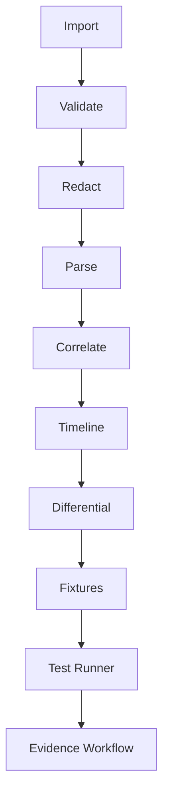

# Phase 20 — Design: Protocol Laboratory

## Package: `com.omnibuds.core.lab` (layer 5)

Passive analysis only. Imports: common (0), state (0). Never imports
feature, protocol, or transport control APIs.

| Component | Type | Role |
|---|---|---|
| Trace model | `ProtocolTrace`, `TraceEvent`, `TraceSourceType`, `TraceDirection` | Versioned offline traces |
| Validation | `TraceValidator`, `TraceValidationError` | Structured rejection |
| Parser framework | `LabParser`, `ParseOutcome`, `StructuredMessage` | Typed parsing |
| Framing | `LengthPrefixedParser` | Generic framing example |
| Correlation | `CorrelationEngine`, `CorrelatedPair` | Evidence-based pairing |
| Timeline | `TimelineBuilder`, `TimelineEntry` | Ordered domain view |
| Differential | `DifferentialAnalyzer`, `TraceDiff` | Comparison without inference |
| Schema registry | `SchemaRegistry`, `LabSchema` | Versioned definitions |
| Fixtures | `FixtureGenerator`, `ParserFixture` | Deterministic test data |
| Test runner | `ParserTestRunner`, `TestRunReport` | Headless CI-suitable |
| Evidence | `EvidenceWorkflow`, `EvidenceTransition` | Promotion rules |

## Key decisions

1. **Passive only.** The lab has no transport handles, no write APIs.
   A parsed message never becomes a command.
2. **Unknown stays unknown.** `semanticMeaning` is null for uninterpreted
   data; hypotheses are human-recorded, never auto-generated.
3. **Synthetic ≠ captured.** Source types are distinct; mislabeling is a
   test failure.
4. **Evidence gates promotion.** Synthetic fixtures cannot produce
   HARDWARE_VERIFIED; the workflow enforces this.

