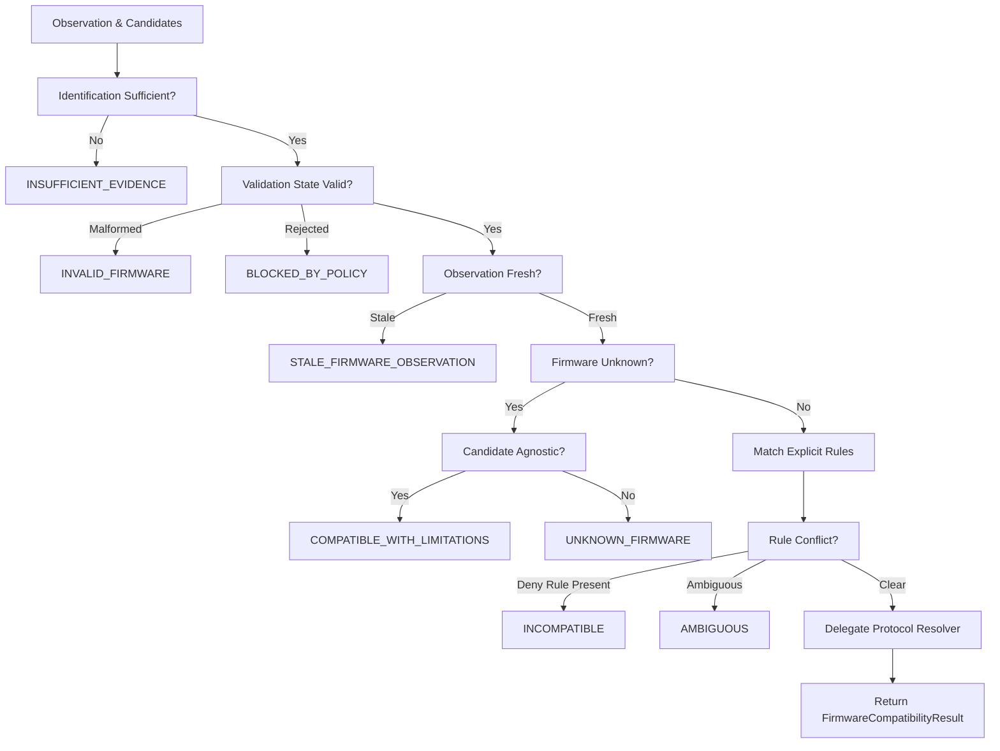

# Phase 45 — Compatibility Resolution & Failure Handling

## 1. Resolution Flow

## 2. Failure Handling
- `INCOMPATIBLE`: Mutating and read-only operations denied. Diagnostic event emitted.
- `UNKNOWN_FIRMWARE`: Mutating operations blocked. Safe read-only permitted if adapter is firmware-agnostic.
- `STALE_FIRMWARE_OBSERVATION`: Operations blocked until a fresh on-device firmware read completes.
- `AMBIGUOUS`: Resolution aborted; no arbitrary winner selected.
