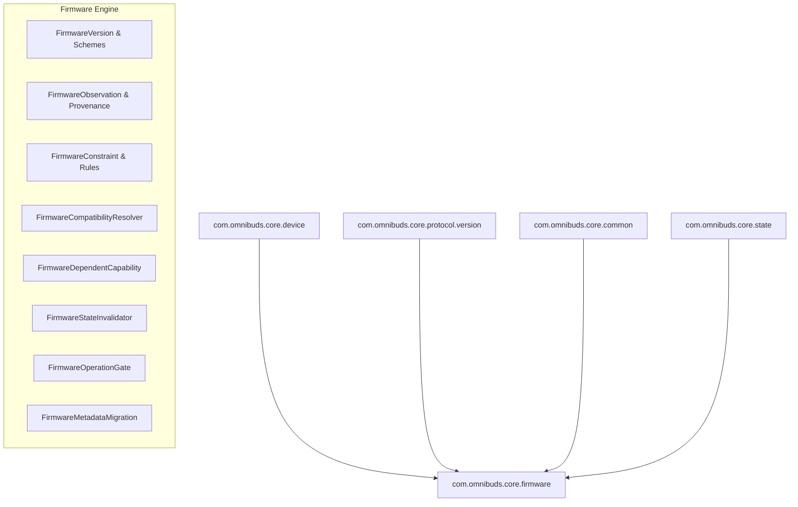

# Phase 45 — Design: Firmware Compatibility & Device Revision Management

## 1. Architectural Overview

Phase 45 introduces the `core.firmware` package, positioned at Layer 5 of the architecture hierarchy. It sits alongside other coordination engines (vendor, configuration, verification) and depends downward on:
- `protocol` (Layer 4)
- `device` (Layer 2)
- `common` (Layer 0)
- `state` (Layer 0)

## 2. Key Components

### 2.1 FirmwareVersion Hierarchy
- Sealed interface `FirmwareVersion` with subtypes:
  - `Semantic`: parsed into major, minor, patch, preRelease. Ordered according to SemVer.
  - `BuildNumber`: monotonic integer revision / build number.
  - `DateBased`: year, month, day, revision. Ordered chronologically.
  - `AlphanumericBuild`: generation, train letter, sequence (e.g. Apple 4E71, 5B58).
  - `Opaque`: raw string preserved without synthetic ordering.
  - `Unknown`: sentinel for missing/unobserved firmware. Never substituted by 0.0.0.

### 2.2 FirmwareObservation & Provenance
- Encapsulates observation metadata: `deviceId`, `rawValue`, `version`, `source` (`DEVICE_DIS_AUTHORITATIVE`, `VENDOR_TELEMETRY`, `PERSISTED_CACHE`, `ADVERTISEMENT_INFERRED`, `TEST_FIXTURE`, `USER_MANUAL_ENTRY`, `UNKNOWN`), `observedAtMs`, `verificationLevel`, `hardwareRevision`, `protocolScope`, `validationState`, `limitations`.
- Freshness checks bound validity to an acceptable TTL (default 300,000 ms).
- Trustworthiness checks ensure user-entered or unprobed data cannot authorize writes.

### 2.3 Compatibility Rules and Resolution
- `FirmwareCompatibilityRule`: binds model scope, firmware constraint, target scope, outcome, and evidence reference.
- `FirmwareCompatibilityResolver`:
  1. Validates identity confidence.
  2. Evaluates observation integrity and freshness.
  3. Evaluates explicit rules (model-specific prioritized over family-wide; deny rules fail safe).
  4. Delegates to underlying `CompatibilityResolver` for wire protocol matching.
  5. Outputs `FirmwareCompatibilityResult`.

### 2.4 Firmware-Dependent Capabilities and Lifecycle
- `FirmwareDependentCapability`: maps feature ID and firmware constraint to available vs. fallback capability states.
- `FirmwareStateInvalidator`: reconciles active capability map and flags pending operations for cancellation upon firmware shift.
- `FirmwareOperationGate`: gates all operations (mutating vs. read-only) before execution.
