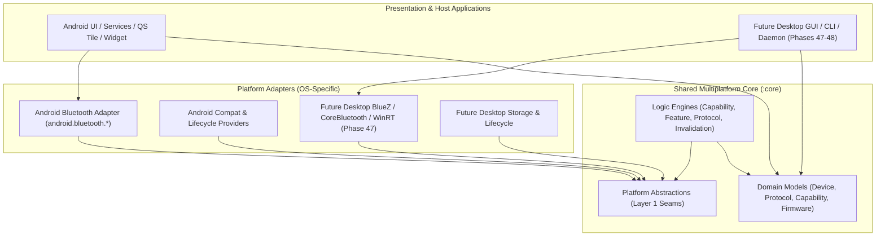

# Phase 46 — Architectural Design: Kotlin Multiplatform Core & Platform Independence

## 1. System Architecture Overview

OmniBuds is architected across three distinct, cleanly separated layers:

---

## 2. Three-Tier Architectural Partitioning

### Tier A: Shared Core (`:core`)
The shared core contains all business logic that is genuinely platform-independent. It compiles targeting multiplatform JVM/KMP environments without OS dependencies.
- **Device & Identity**: `DeviceIdentity`, `DeviceFingerprint`, `IdentityEngine`, `IdentityNormalizer`.
- **Protocol & Versioning**: `ProtocolDefinition`, `ProtocolIdentity`, `CompatibilityResolver`, `ProtocolRegistry`.
- **Capability & Features**: `FeatureRegistry`, `FeatureEngine`, `CapabilityState`, `FeatureCapability`.
- **Audio & Codecs**: `Codec`, `AudioQuality`, `CodecNegotiationState`, pure codec models.
- **Firmware Management**: `FirmwareVersion`, `FirmwareCompatibilityRule`, `FirmwareObservation`, `FirmwareCompatibilityResolver`.
- **Safety & Verification**: `HilSafetyGate`, `AccessPolicyEngine`, `FailureClassification`, `SecurityRedactor`.
- **Platform Seams (Layer 1)**: `PlatformType`, `PlatformDescriptor`, `PlatformIdentifierSource`, `PlatformStoragePort`, `PlatformLifecycleSource`, `PlatformDiagnosticSink`, `PlatformTransportFactory`, `TimeProvider`.

### Tier B: Platform Adapters (`:platform:android`, future `:platform:desktop`)
Platform adapters isolate operating-system-specific APIs behind the platform seams defined by Tier A.
- **Android Adapter**: BLE/GATT scanning, RFCOMM sockets, Android permission checking, Logcat integration, `ActivityLifecycleCallbacks`.
- **Desktop Adapter (Phase 47)**: D-Bus/BlueZ bindings on Linux, IOBluetooth on macOS, WinRT on Windows.

### Tier C: Host Application & Presentation
Host application shells provide process entry points, UI presentation, desktop system trays, Android tiles/widgets, and dependency injection wiring. Core contains no UI or presentation logic.

---

## 3. Platform Abstraction Contracts

The platform boundary is kept intentionally narrow. Abstractions exist only where core domain logic genuinely requires host OS facilities:

| Abstraction | Interface | Purpose | Ownership | Lifecycle |
|---|---|---|---|---|
| **Clock Source** | `TimeProvider` | Epoch timestamps for observation TTL and telemetry | Injected into core coordinators | Process lifetime |
| **Identifier Source** | `PlatformIdentifierSource` | Stable operation correlation IDs and nonces | Injected into operation dispatchers | Process lifetime |
| **Storage Port** | `PlatformStoragePort` | Local key-value record storage | Owned by host, passed to repositories | Bound to repository |
| **Lifecycle Source** | `PlatformLifecycleSource` | App foreground/background/shutdown state | Managed by application platform monitor | Process lifetime |
| **Diagnostic Sink** | `PlatformDiagnosticSink` | Telemetry and logging sink | Managed by diagnostic bootstrap | Process lifetime |
| **Transport Factory** | `PlatformTransportFactory` | Physical Bluetooth channel creation | Injected into transport router | Process lifetime |
| **Platform Descriptor**| `PlatformDescriptor` | OS type, version, architecture, and capabilities | Initialized at application launch | Immutable value |

---

## 4. Concurrency & Flow Architecture

- **Cold Observables**: Live feeds (such as adapter state or lifecycle events) are exposed as cold coroutine `Flow` instances. Collecting opens the underlying resource; cancellation of collection closes it deterministically.
- **Snapshot State**: Current status (e.g. `PlatformLifecycleSource.currentState`) is exposed as immutable snapshot properties backed by thread-safe `StateFlow` primitives.
- **Dispatcher Decoupling**: Core business logic never dispatches to hardcoded Android dispatchers. Execution occurs on the caller's coroutine context or injected standard dispatchers (`Dispatchers.Default` / `Dispatchers.IO`).
- **Bounded Operations**: Suspending platform calls are bounded and cancelable. Cooperative cancellation is propagated without dangling background coroutines.
