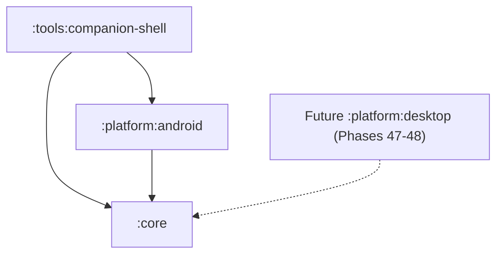

# Phase 46 — Module and Dependency Architecture Map

## 1. System Module Dependency Graph



- **Dependency Rules**:
  - `:core` has **zero** dependencies on `:platform:android`, `:platform:desktop`, or `:tools:companion-shell`.
  - `:platform:android` depends directly on `:core` abstractions via `api(project(":core"))`.
  - Machine-enforced by `DependencyDirectionTest.theAndroidModuleDependsOnCoreAndNotTheReverse`.

---

## 2. Core Internal Layer Architecture Map

`:core` is internally stratified into 7 downwards-only layers (0 to 6):

| Layer | Area Name | Allowed Downward Dependencies | Prohibited Imports |
|---|---|---|---|
| **Layer 0** | `common`, `state` | None (Foundation) | All higher layers |
| **Layer 1** | `transport`, `platform`, `security` | Layer 0 | Layers 2–6 |
| **Layer 2** | `device`, `capability`, `audio`, `config`, `diagnostics` | Layers 0–1 | Layers 3–6 |
| **Layer 3** | `session`, `persistence`, `codec` | Layers 0–2 | Layers 4–6 |
| **Layer 4** | `protocol`, `quality` | Layers 0–3 | Layers 5–6 |
| **Layer 5** | `feature`, `vendor`, `lab`, `access`, `knowledge`, `extension`, `globalstate`, `lifecycle`, `testkit`, `recovery`, `hil`, `protocoltest`, `validation`, `processing`, `battery`, `configuration`, `verification`, `firmware` | Layers 0–4 (no sideways between layer 5 areas) | Layer 6, sideways Layer 5 |
| **Layer 6** | `sdk` (Community Protocol SDK) | Layers 0–5 | None |

---

## 3. Platform Package Allocation

In accordance with Rule 11 of `DependencyDirectionTest.kt`, all platform code lives strictly under authorized root packages:

```
platform/android/src/main/kotlin/com/omnibuds/android/
├── bluetooth/        # Bluetooth Classic, BLE, Gatt, and capability providers
├── di/               # Platform composition and wiring
├── tile/             # Quick Settings TileService implementation
├── notification/     # Notification controls and broadcast receivers
├── widget/           # AppWidgetProvider implementations
├── lifecycle/        # OmniBudsLifecycleMonitor & AndroidPlatformLifecycleSource
└── compat/           # ApiLevelPolicy, AndroidPlatformDescriptor, AndroidPlatformIdentifierSource
```
