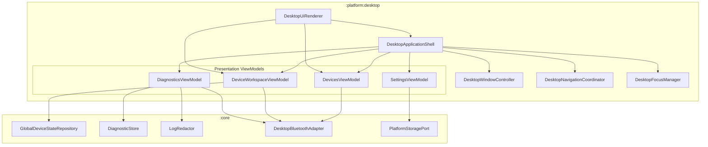

# Phase 48 — Desktop Application Design

## 1. Architectural Philosophy & Constraints

The desktop application for OmniBuds is built around three foundational architectural imperatives:
1. **Hardware Truthfulness**: OmniBuds never simulates hardware capabilities. If an operating system adapter cannot open a vendor protocol socket, the device cannot report battery telemetry, or audio codec telemetry is unobservable on the platform, the application explicitly reports these facts.
2. **Deterministic Offline Testability**: Because the build environment operates without a display server (X11/Wayland) and cannot download graphic toolkit packages (no raw TCP for Gradle), the application separates presentation logic and semantic view trees from toolkit rendering engines.
3. **Strict Layer Direction**: `:platform:desktop` depends solely on `:core`. `:core` retains zero references, zero imports, and zero dependencies on `:platform:desktop` or any UI toolkit, preserving core modularity as validated by `DependencyDirectionTest`.

---

## 2. Component Hierarchy & Data Flow

---

## 3. Layer Breakdown

### A. Application Shell (`shell/`)
- `DesktopApplicationShell`: The central coordinator managing overall application lifecycle, global error state, active theme, window dimensions, and keyboard shortcuts (`Ctrl+1`..`Ctrl+4`, `Ctrl+W`, `Escape`).
- `DesktopWindowController`: Manages window geometry (width, height, min size 640x480), maximize state, minimize state, and title.

### B. Navigation & Routing (`navigation/`)
- `DesktopDestination`: Strongly typed destinations (`Devices`, `DeviceWorkspace(deviceId)`, `Diagnostics`, `Settings`, `About`).
- `DesktopNavigationCoordinator`: Backstack coordinator maintaining linear navigation history with `navigateTo`, `goBack`, and workspace selection helpers.

### C. Presentation ViewModels (`presentation/`)
- `DevicesViewModel`: Observes `DesktopBluetoothAdapter.observeAvailability()` and manages `DesktopDeviceDiscoverySession`. Replaces optimistic scans with truthful status banners and automatic session teardown when the adapter is killed.
- `DeviceWorkspaceViewModel`: Strictly scoped to a single `deviceIdentifier`. Observes `GlobalDeviceStateRepository.observeDevice()` and derives:
  - `DeviceOverviewModel`: Identity verification, confidence, tri-state connection status.
  - `HardwareControlItem`: Verifies whether features are supported in `CapabilityState.Ready` and whether the session is `isVendorControllable`. Unidentified devices are locked to read-only.
  - In-flight operations: Deduplicates rapid actions, tracks `PENDING`, `SUCCEEDED`, and `REJECTED` states.
- `BatteryPresentationModel`: Preserves nullable component readings (Left, Right, Case). Flags readings as stale if older than 60 seconds. Never synthesizes 0%.
- `AudioPresentationModel`: Distinguishes active codec, supported codecs, and configurable codecs. Explicitly reports platform limitations.
- `DiagnosticsViewModel`: Bounded ring of events (max 256 for UI rendering), severity filtering, `LogRedactor` sanitization, and export to schema-compliant sanitized JSON.
- `SettingsViewModel`: User preference management with clamped bounds (e.g. timeout 5–120s, retention 64–2048) and safe fallback for corrupted values.

### D. Design System & Tokens (`theme/`)
- `DesktopTheme`: Encapsulates `ThemeMode` (`DARK`, `LIGHT`, `HIGH_CONTRAST`, `SYSTEM`) and `UiDensity` (`COMFORTABLE`, `COMPACT`).
- `DesktopColors`: Provides WCAG 2.1 AA compliant color tokens ensuring >= 4.5:1 text-to-background contrast across dark, light, and high-contrast modes.
- `DesktopTypography`, `DesktopSpacing`, `DesktopShapes`: Predictable layout and typography constants.

### E. Accessibility Architecture (`accessibility/`)
- `AccessibilityNode`: Headless semantic tree node representing screen structure, labels, roles (`WINDOW`, `PANE`, `LIST`, `BUTTON`, `ALERT`, etc.), states (`focused`, `disabled`, `selected`), and available actions (`CLICK`, `SCROLL`, `DISMISS`).
- `DesktopFocusManager`: Manages linear tab traversal order (`focusNext()`, `focusPrevious()`) and directional keyboard navigation.

### F. Headless UI Renderer (`ui/`)
- `DesktopUiRenderer`: Translates current view model states and application shell into complete semantic trees for automated verification, accessibility tools, and headless inspection.
