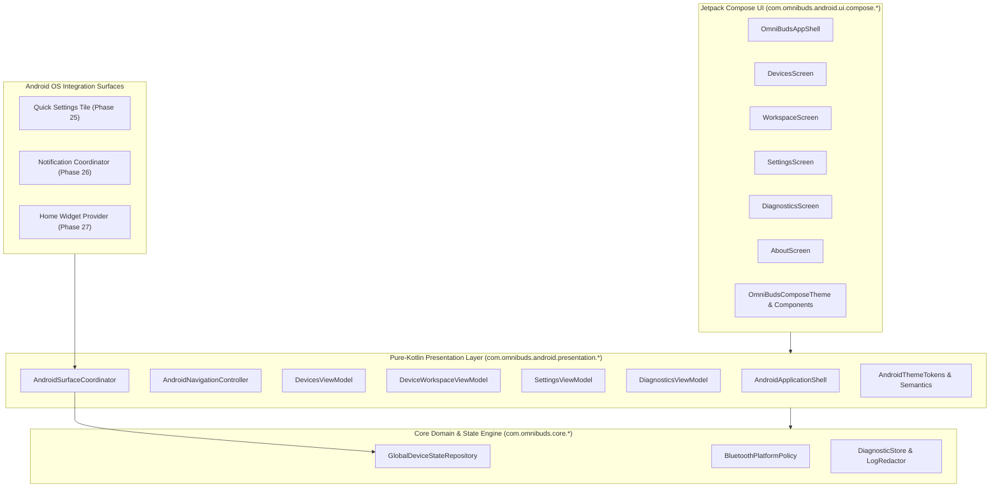

# Phase 49 — Android UI Architectural Design

## 1. Architectural Philosophy & Principles

The OmniBuds Android UI is constructed according to four foundational tenets:

1. **Hardware Truthfulness**: No synthetic battery meters, simulated codec switches, or fictitious toggles. Controls and status are surfaced solely when corroborated by the domain state engine.
2. **Layer Invariance & Headless Testability**: The presentation logic is implemented entirely in pure Kotlin (`com.omnibuds.android.presentation.*`), depending strictly on `:core` and platform compatibility types. This architecture decouples all state transformations from Android view hierarchies and Jetpack Compose runtime internals, permitting 100% deterministic unit testing in headless, offline environments.
3. **Declarative Compose UI**: Jetpack Compose (`com.omnibuds.android.ui.compose.*`) is utilized as a declarative rendering layer that observes immutable `StateFlow` streams exposed by view models, emitting UI events back to the view models without retaining business logic.
4. **Cross-Surface Consistency**: Android provides multiple surface modalities (Main UI, Quick Settings Tiles, Media Notifications, App Widgets). The `AndroidSurfaceCoordinator` acts as the single source of truth across all four surfaces, preventing state drift or split-brain conditions.

---

## 2. System Architecture & Component Diagram

---

## 3. Subsystem Breakdown

### 3.1 Pure-Kotlin Presentation Architecture
- **StateFlow Driven**: All view models expose read-only `StateFlow<T>` models containing immutable data classes.
- **Concurrency & Synchronization**: View models utilize internal `Mutex` instances to sequence state transitions, preventing race conditions from concurrent Bluetooth callbacks.
- **Lifecycle Cleanliness**: Each presentation controller provides an explicit `cleanUp()` hook that cancels active observation jobs and in-flight discovery sessions.

### 3.2 Main Application Shell & Navigation
- **Navigation Controller** (`AndroidNavigation.kt`): Manages the current `AndroidDestination` (`DEVICES`, `WORKSPACE`, `DIAGNOSTICS`, `SETTINGS`, `ABOUT`) and maintains a non-cyclical back-stack history.
- **Application Shell** (`AndroidApplicationShell.kt`): Coordinates navigation, persistent theme tokens (light/dark/system and high-contrast), and global snackbar/error banners.

### 3.3 Devices & Discovery Management
- **DevicesViewModel** (`DevicesViewModel.kt`): Evaluates `BluetoothPlatformPolicy` on the current `BluetoothPlatformState`. Manages scanning via `AndroidDeviceDiscoverySession` and continuously ingests known devices from `GlobalDeviceStateRepository`.
- **Deduplication Engine**: Discovered accessories are keyed by unique identifier; updates with new RSSI or connection state modify existing entries rather than causing list churn.

### 3.4 Device Workspace & Hardware Controls
- **DeviceWorkspaceViewModel** (`DeviceWorkspaceViewModel.kt`): Scoped to a specific device ID. Derives device overview, battery models, audio/codec telemetry, and feature controls.
- **HardwareControlModel**: Classifies capabilities into `PERSISTENT`, `SESSION_ONLY`, `READ_ONLY`, `UNSUPPORTED`, or `UNKNOWN`. Disables actions for non-actionable controls and coordinates operation dispatching (`Pending` -> `Succeeded`/`Rejected`) without false optimism.

### 3.5 Cross-Surface Coordination
- **AndroidSurfaceCoordinator** (`AndroidSurfaceCoordinator.kt`): Binds the UI's active device selection to background surfaces. When a user navigates to a device in the UI, the Quick Settings Tile, Ongoing Notification, and App Widget immediately synchronize to manage that device.
