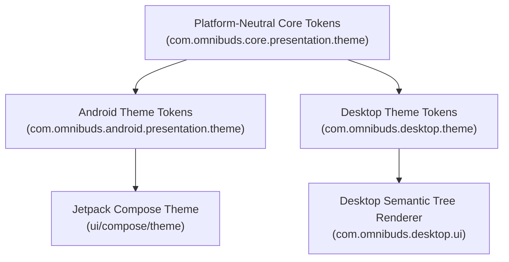
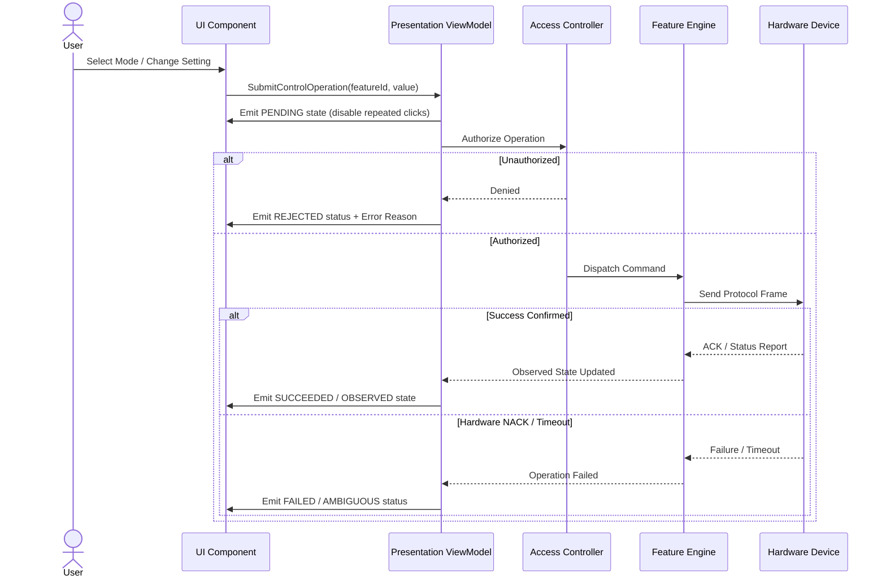

# Phase 50 — Unified UI/UX Consolidation Design

## 1. Unified Brand & Design Principles

OmniBuds is an evidence-first, privacy-respecting hardware controller for Bluetooth earbuds and headphones. Across Android and Desktop, the product adheres to five core design principles:

1. **Hardware Truthfulness Above Symmetry**: The interface never fabricates controls, battery percentages, or active codecs to make a device appear more capable or visually complete.
2. **Deterministic State Feedback**: User interactions reflect in-flight reality. Submitting a change transitions through requested, executing, and acknowledged/observed states. Failures and rejections are explicit.
3. **Platform-Native Naturalness**: Unified design means a shared visual language, tokens, and semantic contracts—not identical pixels. Android respects Material 3 touch targets (48dp), system back gestures, and OS surfaces; Desktop provides keyboard focus, density options, and resizable layout structures.
4. **Accessible by Design**: All components meet WCAG 2.1 AA/AAA contrast ratios, provide text alternatives for non-text indicators, avoid color-only status, and support assistive technologies (TalkBack and Desktop accessibility trees).
5. **Zero Compromise Security & Privacy**: Diagnostics redact hardware MAC addresses; all operations go through centralized authorization; zero telemetry or network calls occur.

---

## 2. Design Token Architecture

The token system is structured in three tiers:
- **Foundational Global Tokens**: Base color constants, typography scales, spacing units, and radius values.
- **Semantic Theme Tokens**: Role-based color tokens (`primary`, `surface`, `statusAvailable`, `statusError`) resolved per theme mode (`Dark`, `Light`, `HighContrast`).
- **Component & Platform Tokens**: Platform-specific adaptations (e.g. `AndroidTouchTargets`, `DesktopSpacing`, Compose Color wrappers).

### Color Palette (WCAG AA/AAA Verified)
| Token | Dark Mode | Light Mode | High Contrast | Semantic Role |
|---|---|---|---|---|
| `background` | `#121316` | `#F8FAFC` | `#000000` | Application canvas |
| `surface` | `#1A1C20` | `#FFFFFF` | `#0A0A0A` | Container & card background |
| `surfaceElevated` | `#242830` | `#F1F5F9` | `#1A1A1A` | Modals, elevated cards |
| `surfaceVariant` | `#2E333D` | `#E2E8F0` | `#262626` | Secondary grouping surfaces |
| `onBackground` | `#E6EDF3` | `#0F172A` | `#FFFFFF` | Primary text on canvas |
| `onSurface` | `#E0E4E8` | `#1E293B` | `#FFFFFF` | Primary text on cards |
| `onSurfaceVariant`| `#9CA3AF` | `#64748B` | `#F0F0F0` | Secondary / hint text |
| `primary` | `#38BDF8` | `#0284C7` | `#00E5FF` | Action buttons, active indicators |
| `onPrimary` | `#031525` | `#FFFFFF` | `#000000` | Text/icons on primary |
| `outline` | `#374151` | `#CBD5E1` | `#FFFFFF` | Borders & dividers |
| `statusAvailable`| `#22C55E` | `#16A34A` | `#00FF66` | Connected, verified, success |
| `statusWarning` | `#F59E0B` | `#D97706` | `#FFD700` | Stale data, read-only, degraded |
| `statusError` | `#EF4444` | `#DC2626` | `#FF3333` | Disconnected, rejected, error |
| `statusNeutral` | `#6B7280` | `#64748B` | `#B0B0B0` | Unknown, idle, disabled |
| `statusActive` | `#38BDF8` | `#0284C7` | `#00E5FF` | Operation pending, active mode |

### Spacing Grid (4dp Base)
- `none`: 0 dp / px
- `xs`: 4 dp / px
- `sm`: 8 dp / px
- `md`: 16 dp / px
- `lg`: 24 dp / px
- `xl`: 32 dp / px
- `xxl`: 48 dp / px

### Shapes (Corner Radii)
- `none`: 0 dp
- `small`: 4 dp (chips, small badges)
- `medium`: 8 dp (buttons, input fields)
- `large`: 12 dp (cards, containers)
- `extraLarge`: 16 dp (dialogs, bottom sheets)
- `pill`: 999 dp (fully rounded buttons)

---

## 3. Domain State to User-Facing Presentation Mapping

The table below provides the authoritative mapping between domain states and user-facing presentation labels, descriptions, and visual statuses across both platforms:

| Domain State / Category | User-Facing Label | Presentation Description | Visual Status Token | Actionable? |
|---|---|---|---|---|
| `ConnectionState.Disconnected` | **Disconnected** | Device is not currently connected via Bluetooth. | `statusError` | No |
| `ConnectionState.Connecting` | **Connecting…** | Establishing Bluetooth link with device. | `statusNeutral` | No |
| `ConnectionState.Connected` (Unidentified) | **Connected (Identifying)** | Bluetooth link active; reading device identity and profiles. | `statusNeutral` | No |
| `ConnectionState.Connected` + `Ready` | **Ready** | Connected with verified vendor protocol and controllable capabilities. | `statusAvailable` | Yes |
| `ConnectionState.Disconnecting` | **Disconnecting…** | Terminating active Bluetooth link. | `statusNeutral` | No |
| `Discovered` (Scan result) | **Discovered** | Nearby device observed advertising over Bluetooth LE or Classic. | `statusNeutral` | Can Select |
| `Paired` (OS Bonded) | **Paired** | Device is bonded in OS Bluetooth settings but not connected. | `statusNeutral` | Can Connect |
| `SessionClassification.ActiveControl` | **Control Session Active** | Authorized vendor protocol session established and actively listening. | `statusActive` | Yes |
| `CapabilityState.Uncertain` | **Capability Unknown** | Feature capability has not yet been probed or verified. | `statusNeutral` | No |
| `CapabilityState.Discovered` (Read-only) | **Read-Only** | Feature telemetry is observable but cannot be modified. | `statusWarning` | No |
| `FeatureCapabilityKind.UNSUPPORTED` | **Unsupported** | Hardware does not support this feature. | `statusNeutral` | No |
| `FeatureCapabilityKind.PERSISTENCE_VERIFIED`| **Persistence Verified** | Setting is written and confirmed retained across device power cycles. | `statusAvailable` | Yes |
| `OperationStatus.Pending` | **Working…** | Control command submitted; awaiting hardware acknowledgement. | `statusActive` | In-Flight |
| `OperationStatus.Rejected` | **Operation Rejected** | Hardware or access controller rejected the requested change. | `statusError` | Can Retry |
| `OperationStatus.Ambiguous` | **Outcome Unknown** | Command timed out or link dropped before confirmation. | `statusWarning` | Can Reconcile |
| `AdapterState.Disabled` | **Bluetooth Disabled** | Host Bluetooth radio is powered off. | `statusError` | Enable in OS |
| `PermissionState.Denied` | **Permission Required** | Operating system Bluetooth permission not granted. | `statusWarning` | Grant in OS |

---

## 4. Hardware-Control Feedback Contract

All hardware controls adhere to the unified 10-step interaction contract:

---

## 5. Truthful Battery & Audio Presentation

### Battery Telemetry Rules
- **Missing Data**: If battery level is unavailable, it is represented as `null` / `"Unknown"`. It is **never** coerced to `0%`.
- **Per-Component Reporting**: If independent Left, Right, or Case readings exist, each component is displayed with its own percentage and charging indicator (`⚡`).
- **Staleness**: Telemetry older than 60 seconds is visually flagged as `(stale)` and announced to screen readers as "reading may be outdated".
- **Charging State**: Charging state is shown only when reported by the device (`isCharging == true`).

### Audio & Codec Rules
- **Evidence Requirement**: Active codec is displayed only when corroborated by observable audio transport data.
- **OS Reality**: Public Android APIs (API 26-35) and standard desktop APIs do not expose active A2DP codecs without private APIs or elevated privileges. The UI displays an honest explanation rather than guessing.
- **No Synthetic DSP**: OmniBuds does not pretend to offer an equalizer if the device hardware lacks onboard DSP EQ.

---

## 6. Reusable Component Catalog

| Component | Purpose | Interaction States | Accessibility Semantics |
|---|---|---|---|
| **PrimaryButton** | Prominent action trigger | Idle, Hover, Pressed, Focused, Disabled, Loading | Role: `BUTTON`, Announce label + loading state |
| **SecondaryButton** | Alternative action | Idle, Hover, Pressed, Focused, Disabled | Role: `BUTTON` |
| **StatusBadge** | Semantic state indicator | Static pill display | Role: `STATUS`, Text content description |
| **HardwareControlCard** | Feature toggle/selector | Idle, Pending, Disabled, Error | Role: `REGION`, Child inputs with full labels |
| **SegmentedModeSelector** | Discrete mode selection (ANC/Transparency/Normal) | Selected, Unselected, Disabled | Role: `TAB_PANEL` / Group, `isSelected` state |
| **BatteryCard** | Multi-component power display | Normal, Stale, Unavailable | Role: `REGION`, TalkBack description covering all parts |
| **AudioCard** | Codec & route telemetry | Normal, Unavailable | Role: `REGION`, Honest limitations announced |
| **EmptyStateView** | Guides user when lists are empty | Static guidance + action | Role: `REGION`, Clear instructions |
| **ErrorBannerView** | Recoverable or fatal error notice | Dismissible, Actionable | Role: `ALERT`, Associated error message |

---

## 7. Platform-Specific UX Adaptations

### Android Adaptation
- **Touch Ergonomics**: All interactive elements satisfy the 48x48dp minimum touch target (`AndroidTouchTargets.minTouchTargetDp`).
- **Navigation**: Uses Jetpack Compose back stack and system back gesture handler.
- **System Surfaces**: Quick Settings Tile, Media Notification, and App Widget provide glanceable control backed by `AndroidSurfaceCoordinator`.
- **Responsive Layout**: Adapts between Compact (<600dp), Medium (600-839dp), and Expanded (>=840dp) size classes.

### Desktop Adaptation
- **Density Controls**: Supports Comfortable (roomy) and Compact (dense) layouts.
- **Keyboard Navigation**: Full Tab navigation order, arrow-key adjustments, and visible focus rings (`focusRing` color).
- **Window Resizing**: Supports window resizing without state reset; responsive sidebar/navigation rail layout.
- **Diagnostics Inspection**: Multi-column diagnostic log viewer with severity filtering and JSON sanitization export.

---

## 8. Accessibility & Localization Conventions

- **Contrast Ratios**: Normal text >= 4.5:1; Large text >= 3.0:1; High Contrast mode >= 7:0:1.
- **Screen Reader Announcements**: Synthesized TalkBack and Desktop tree announcements provide full state without visual dependence.
- **Centralized Vocabulary**: All strings, capability names, and error descriptions are centralized in `OmniBudsStrings` to ensure exact phrasing parity.
