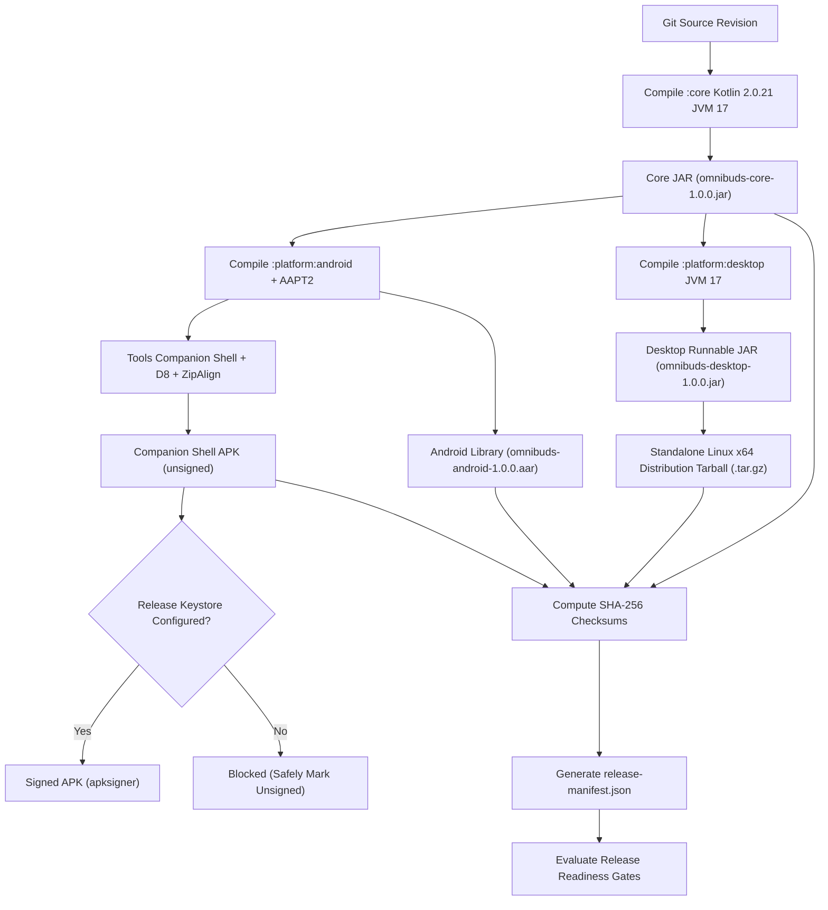

# Phase 51 — Release Engineering Architecture & Design

## 1. Release Architecture Overview

OmniBuds release engineering implements a multi-target build pipeline for Kotlin Multiplatform (Android library, Desktop application, JVM shared core, and companion verification shell) designed for reproducibility, secret safety, and supply-chain transparency.

---

## 2. Supported Build Targets & Artifact Matrix

| Target Name | Artifact Format | Toolchain / Build Task | Environment / Runner | Signing Status | Notes / Limitations |
|---|---|---|---|---|---|
| `:core` | `.jar` | `kotlinc` 2.0.21, JVM 17 (`scripts/release_build.sh:1`) | Linux / Any JVM 17+ | N/A (library) | Contains pure domain, capability, and protocol models. |
| `:platform:desktop` | `.jar` | `kotlinc` 2.0.21, JVM 17 (`scripts/release_build.sh:3`) | Linux / Any JVM 17+ | Unsigned JAR | Runnable fat JAR with `DesktopApplicationMainKt` entrypoint. |
| `:platform:desktop` | `.tar.gz` | `tar`, `gzip` (`scripts/release_build.sh:3`) | Linux x86_64 | Standalone Archive | Bundles executable launcher `bin/omnibuds-desktop` + dependencies. |
| `:platform:android` | `.aar` | `aapt2`, `kotlinc`, `zip` (`scripts/release_build.sh:4`) | Linux / Android SDK 35 | N/A (library) | Contains classes.jar, AndroidManifest.xml, and compiled resources. |
| `companion-shell` | `.apk` | `aapt2`, `kotlinc`, `d8`, `zipalign` (`scripts/release_build.sh:5`) | Linux / Android SDK 35 | Unsigned (Default) | Standalone test/verification APK. Signed only if secrets supplied. |

---

## 3. Versioning Strategy

Versioning is governed by `com.omnibuds.core.release.ApplicationVersion`:
- **Application Version Name**: `1.0.0`
- **Android Version Code**: `1000000` (derived as `major * 1,000,000 + minor * 10,000 + patch * 100 + buildNumber`)
- **Version Separation**: The application semantic version is strictly independent of:
  - `ProtocolSchemaVersion` (Layer 4)
  - `CommunitySdkVersion` (Layer 6)
  - `ConfigurationSchema.CURRENT_VERSION` (Layer 5)
  - `KnowledgeCodecs.SCHEMA_VERSION` (Layer 5)

---

## 4. Android Signing Design & Secret Isolation

1. **Zero Secret Footprint**: No keystores, certificates, or passwords are stored in version control or test files.
2. **Environment-Driven Injection**:
   - `RELEASE_KEYSTORE_PATH`: Path to production JKS/PKCS12 keystore.
   - `RELEASE_KEYSTORE_PASSWORD`: Keystore passphrase.
   - `RELEASE_KEY_PASSWORD`: Key alias passphrase.
3. **Safe Fallback**: When secrets are absent, the pipeline produces the unsigned aligned APK (`omnibuds-companion-shell-1.0.0-unsigned.apk`) and records the signed artifact as `BLOCKED_NO_KEYS`.

---

## 5. Artifact Provenance & Release Manifest

The pipeline generates `release-manifest.json` following Schema v1:
- Commit SHA and ISO-8601 build timestamp.
- Comprehensive list of artifacts with byte size, filename, format, and SHA-256 digest.
- Evaluation status of all release readiness gates.

---

## 6. Release Readiness Gates

| Gate ID | Description | Mandatory? | Gate Status |
|---|---|---|---|
| `GATE-01` | Core & Architecture Tests Pass | Yes | **PASSED** (22/22 tests pass; DependencyDirectionTest clean) |
| `GATE-02` | Android & Desktop Compilations Pass | Yes | **PASSED** (All modules compiled with `-Werror`) |
| `GATE-03` | Non-Zero Artifacts Produced | Yes | **PASSED** (5 primary artifacts created in `build/release-dist/`) |
| `GATE-04` | Checksums & Manifest Validated | Yes | **PASSED** (SHA-256 verified) |
| `GATE-05` | Hardware Truth Preserved | Yes | **PASSED** (Zero mock hardware states in release configurations) |
| `GATE-06` | Production Secret Signing | Conditional | **BLOCKED** (`NO_SIGNING_KEYS`; safely unsigned) |
| `GATE-07` | Physical Hardware Verification | Mandatory for Prod | **DEFERRED** (Phase 52 QA Lead responsibility) |
